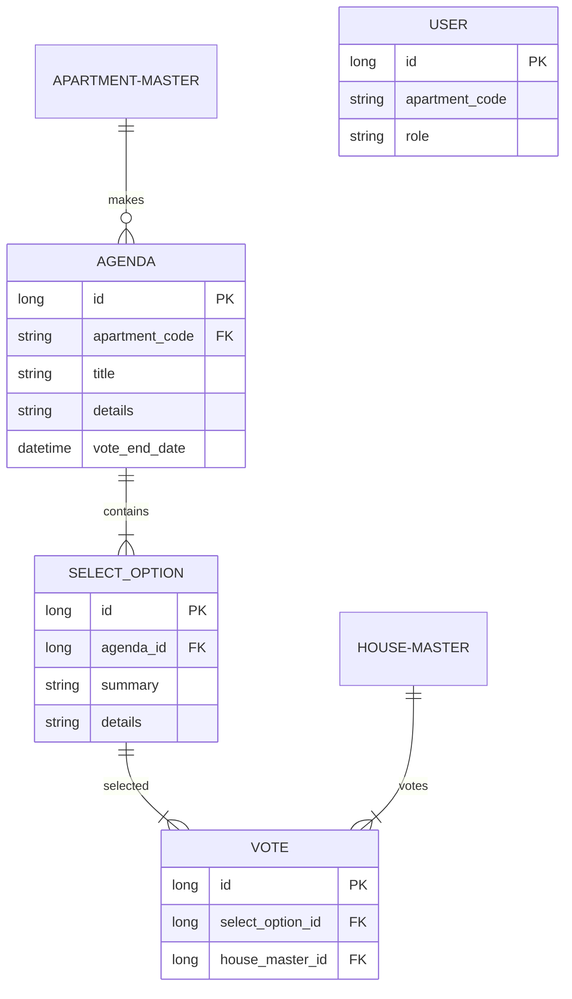

# 주민회의 앱 개발 계획

1. 유저의 타입
    1. 관리자 → 고객관리
    2. 부녀회장
    3. 부녀회원
    4. 세대주
    5. 일반 유저

   |  | 부녀회원 임명 | 안건 상정 | 투표 | 부녀회장 후보 가능성 |
   | --- | --- | --- | --- | --- |
   | 부녀회장  | O | O | O | O |
   | 부녀회원  | X | O | O | O |
   | 세대주   | X | X | O | O |
   | 일반 유저 | X | X | X | X |
2. 주민회의 앱의 기본 컨셉
    1. 각 부녀회장들은 아파트의 투표 안건을 상정할 수 있음
    2. 상정한 안건에 대해 기간을 정하고 투표를 진행함
        1. 비밀회의가 기본이고 세대주만이 투표를 할 수 있다
    3. 기간이 지나면 투표 결과가 나온다
    4. 추가 기능 → 각 투표 안건 별 의견방
3. 안건 및 투표
    1. 기본으로 제공할 안건 타입
        1. 부녀회장 선출
        2. 어떤 일에 대한 찬반 투표
        3. 그 외의 커스텀 안건
    2. 각 선택지는 기본 설명 + 추가설명을 가진다.
    3. 비밀 여부도 선택 가능
4. 유저의 등록 관리
    1. 각 주민들은 각자 발송된 코드로 인해 결정된다.
    2. 한 세대당 한 사람이 세대주로 등록이 되며 세대원간의 만장 일치로 세대주를 변경할 수 있다.
    3. 이사 등으로 위치를 변경할 수 있으며 우편물 방송을 신청하여 우편물에 지정된 코드를 입력하면 기존 세대주들이 등록해제 된다. (기간은 한달에 한번 신청 가능)
5. 각 아파트 세대, 또는 동네 게시판 (대숲)

### 투표 관련 ERD

활용할 기술 spring batch 와 kafka 를 활용한 비동기 투표 결과 처리