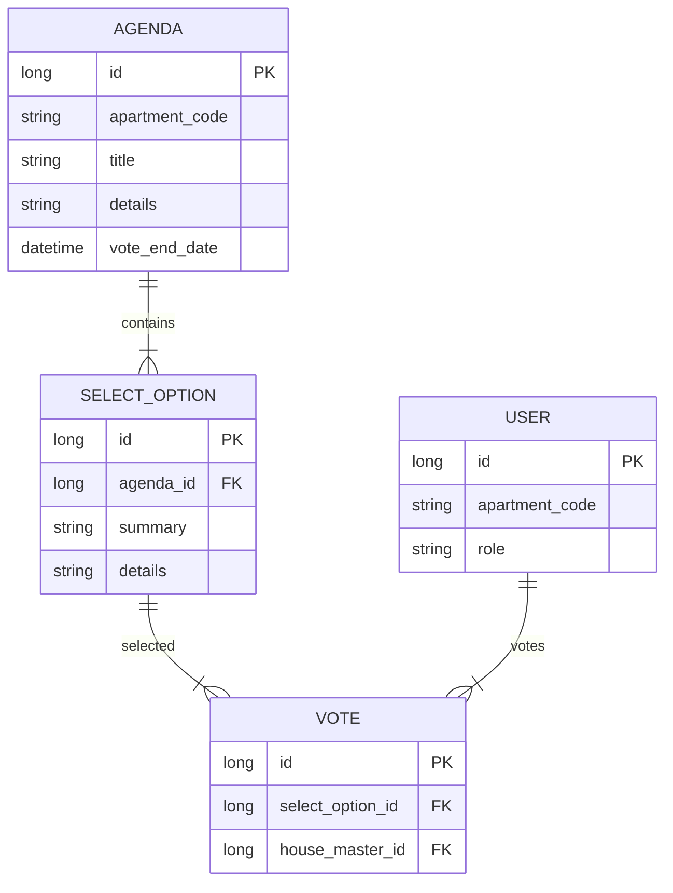
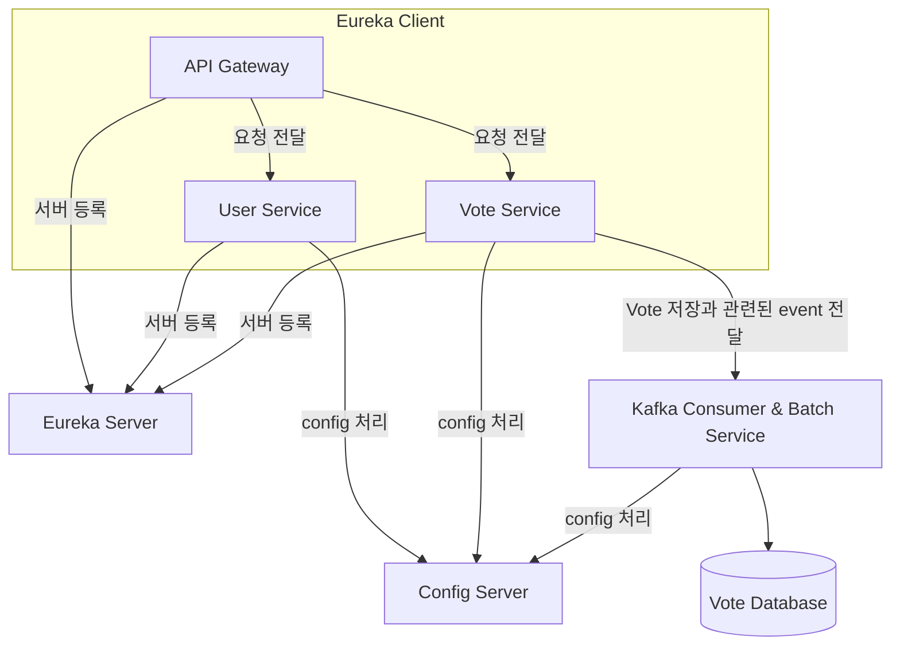
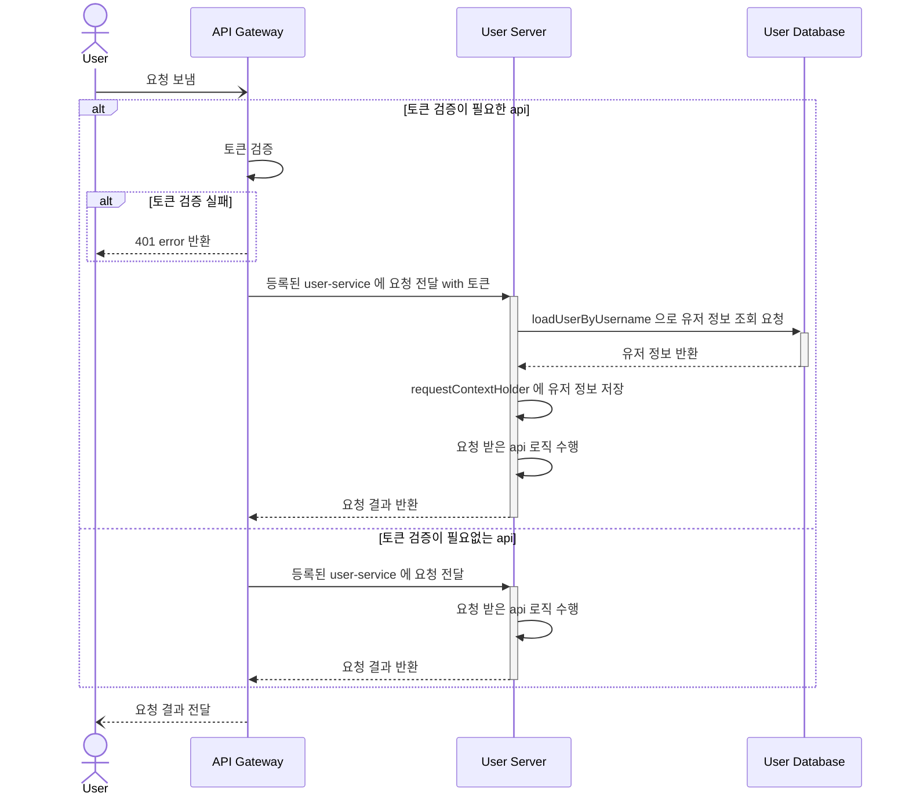
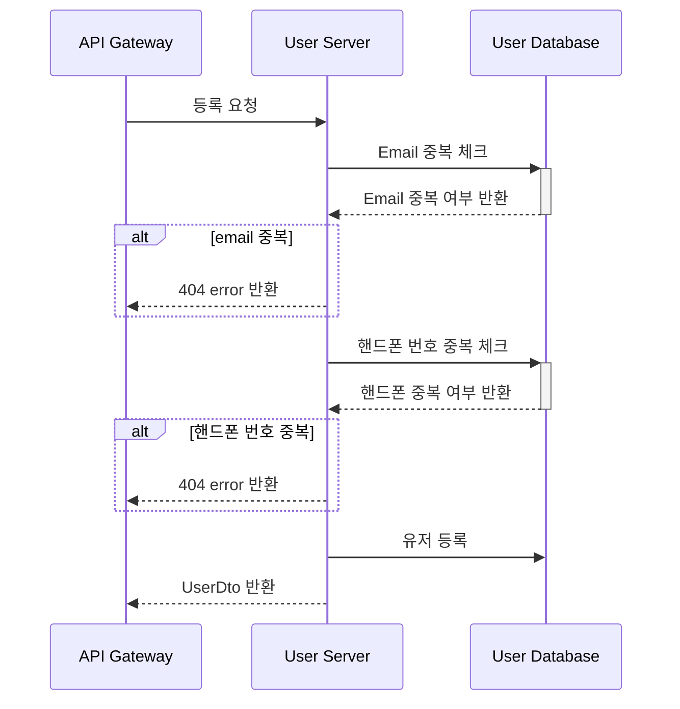
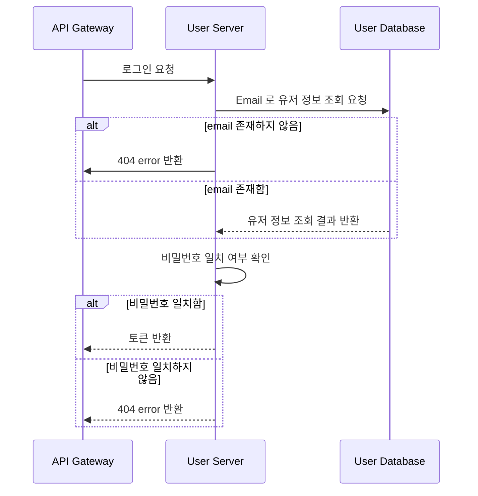
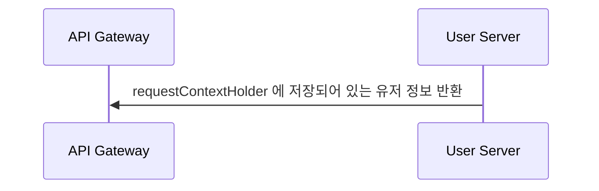
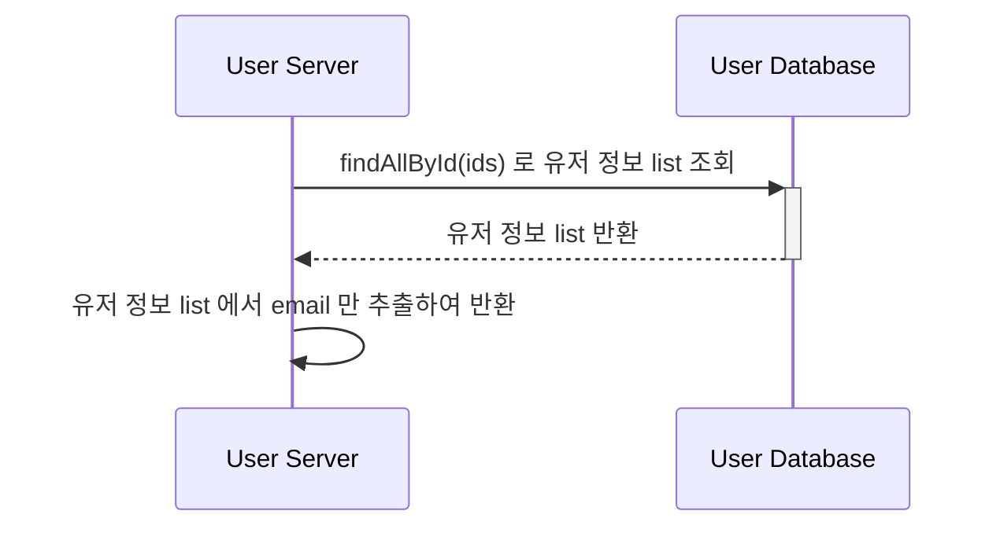
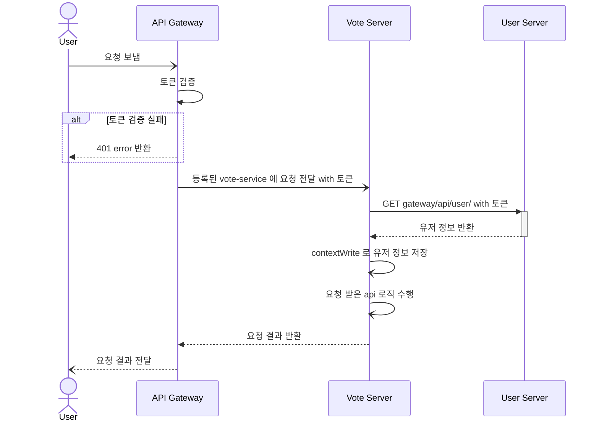
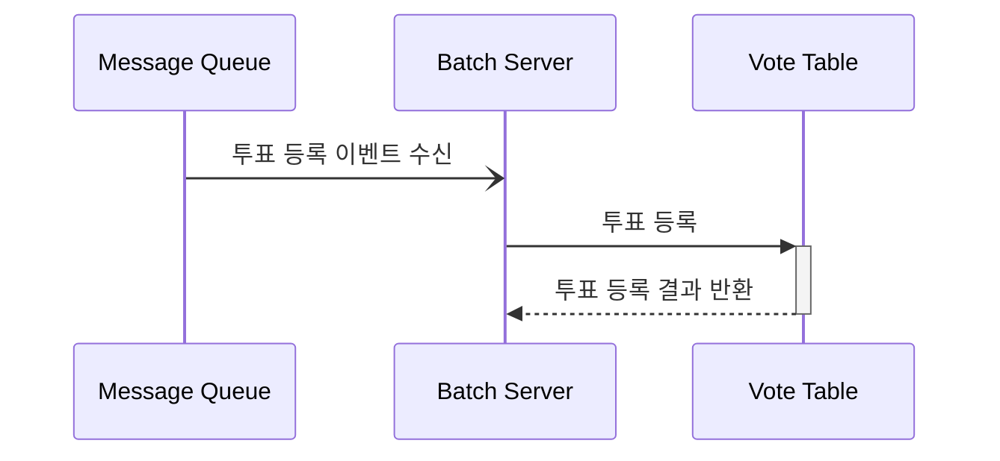
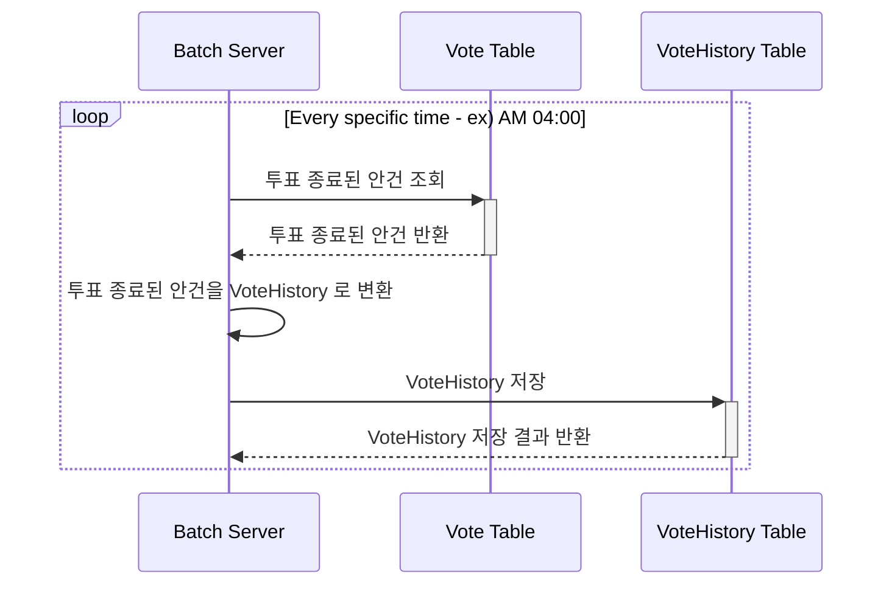

# 주민회의 앱 개발 계획

### 주민회의 앱의 기본 컨셉
1. 유저의 타입
    1. 관리자 → 고객관리
    2. 부녀회장
    3. 부녀회원
    4. 세대주
    5. 일반 유저

   |  | 부녀회원 임명 | 안건 상정 | 투표 | 부녀회장 후보 가능성 |
   | --- | --- | --- | --- | --- |
   | 부녀회장  | O | O | O | O |
   | 부녀회원  | X | O | O | O |
   | 세대주   | X | X | O | O |
   | 일반 유저 | X | X | X | X |
2. 주민회의 앱의 기본 기능
    1. 각 부녀회장들은 아파트의 투표 안건을 상정할 수 있음
    2. 상정한 안건에 대해 기간을 정하고 투표를 진행함
        1. 비밀회의가 기본이고 세대주만이 투표를 할 수 있다
    3. 기간이 지나면 투표 결과가 나온다
       1. 비밀 투표의 경우 투표 종료 시점까지 투표 결과를 볼 수 없다.
       2. 추후에 비밀 투표가 아닌 안건으로 만들 수 있을 가능성을 생각해서 read api 를 구성한다.
       3. 각 선택지에 투표한 사람 수가 나오고 선택지를 클릭하면 그 선택지에 투표한 사람을 볼 수도 있는 api 도 설계하되 기본적으로는 볼 수 없도록 한다.
    4. (추가 기능 → 각 투표 안건 별 의견방)
3. 안건 및 투표
   1. 각 선택지는 기본 설명 + 추가설명을 가진다.
   2. 비밀 여부도 선택 가능
4. 유저의 등록 관리(이후 추가 예정)
    1. 각 주민들은 각자 발송된 코드로 인해 결정된다.
    2. 한 세대당 한 사람이 세대주로 등록이 되며 세대원간의 만장 일치로 세대주를 변경할 수 있다.
    3. 이사 등으로 위치를 변경할 수 있으며 우편물 방송을 신청하여 우편물에 지정된 코드를 입력하면 기존 세대주들이 등록해제 된다. (기간은 한달에 한번 신청 가능)

### MICROSERVICE 구성
1. EUREKA SERVER (Residents Meeting - 가장 바깥 프로젝트)
2. API GATEWAY 
3. CONFIG SERVER
4. USER SERVICE
5. VOTE SERVICE (Spring Webflux)
6. KAFKA CONSUMER & BATCH SERVICE

### ERD


### 서비스 전체 구조 (MSA Architecture)

- 장점
  - 각 서비스들이 독립적으로 동작하기 때문에 서비스의 확장성이 높다.
  - 각 서비스들이 독립적으로 동작하기 때문에 서비스의 장애가 전체 서비스에 영향을 미치지 않는다.
  - vote service 의 경우 data insert 가 비동기 방식으로 동작하기 때문에 여러 개의 instance 를 띄울 수 있다.

- 단점
  - 각 서비스들이 독립적으로 동작하기 때문에 서비스 간의 통신이 필요할 때마다 http 통신을 해야 한다.
  - 데이터의 insert 가 비동기 방식으로 동작하기 때문에 데이터의 일관성을 관리하는 것이 어렵다
  - 시스템의 복잡도가 증가한다.

### USER SERVICE API SEQ DIAGRAM

0. USER SERVICE 의 요청 전달시 거치는 과정


1. 유저 등록

2. 유저 로그인


3. 유저 정보 조회


4. 유저 이메일 가져오기 (vote service 에서 사용)


### VOTE SERVICE API SEQ DIAGRAM
0. VOTE SERVICE 의 요청 전달시 거치는 과정


1. 안건
   1. 안건 등록
    ```mermaid
    sequenceDiagram
        participant B as API Gateway
        participant C as Vote Server
        participant D as Message Queue
        C -) C : context 에 저장된 userInfo 로 유저 권한 조회
        alt 유저 권한이 HOUSE_LEADER 이하
            C --) B : 403 error 반환
        end
        C -) C : AgendaCreationDto 를 AgendaEvent 로 변환
        C -) D : AgendaEvent 를 kafka 에 전달
        D --) C : message 전달 성공 여부 반환
    ```
   2. 안건 조회
    ```mermaid
    sequenceDiagram
        participant A as API Gateway
        participant B as Vote Server
        participant C as AgendaHistory Table
        participant D as Agenda Table
        A -) B : agendaId 로 agenda 조회
        B -) B : context 에 저장된 userInfo 로 유저 권한 조회
        alt 유저 권한이 UNREGISTERED
            B --) A : 403 error 반환
        end
            B -) C : agendaId 로 AgendaHistory 조회
            alt agendaHistory 존재하지 않음
                B -) D : agenda 와 selectOption 정보 fetch join 요청
                D --) B : 요청 정보 반환
                B -) B : agenda 와 selectOption 정보를 agendaHistory 로 변환
            else 존재함
                C --) B : agendaHistory 반환
            end
            B -) B : userInfo 의 apartment code 와 agendaHistory 의 apartment code 비교
            alt 불일치
                B --) A : 404 error 반환                   
            end
            B --) A : agendaHistory 전달    
        
    ```
2. 투표
   1. 투표 등록
    ```mermaid
    sequenceDiagram
        participant B as API Gateway
        participant C as Vote Server
        participant D as Agenda Table
        participant E as Message Queue
        
        C -) C : context 에 저장된 userInfo 로 유저 권한 조회
        alt 유저 권한이 MEMBER 이하
            C --) B : 403 error 반환
        end
       
        C -) D : selectOptionId 로 agenda 조회
        D --) C : agenda 반환   
        C -) C : agenda 와 user info 의 apartment code 비교
        alt 불일치
            C --) B : 404 error 반환
        end
   
        C -) C : agenda 의 voteEndDate 와 현재 시간 비교
        alt 투표 종료 시간이 지남
            C --) B : 404 error 반환
        end
   
        C -) C : VoteDto 를 VoteEvent 로 변환
        C -) E : VoteEvent 를 kafka 에 전달
        E --) C : message 전달 성공 여부 반환
    ``` 
   2. 안건에 대한 내 투표(선택지) 조회
   ```mermaid
    sequenceDiagram
        participant A as API Gateway
        participant B as Vote Server
        participant C as Vote Table
   
        B -) B : context 에 저장된 userInfo 로 유저 권한 조회
        alt 유저 권한이 UNREGISTERED
            B --) A : 403 error 반환
        end
        B -) C : agendaId 로 투표 조회(가장 마지막으로 투표한 선택지)
        C --) B : 투표 반환
        B --) A : 투표 반환
   ```
   
   3. 선택지별 투표수 조회
   ```mermaid
    sequenceDiagram
        participant A as API Gateway
        participant B as Vote Server
        participant C as Agenda Table
        participant D as Vote Table        
        participant E as AgendaHistory Table  

        B -) B : context 에 저장된 userInfo 로 유저 권한 조회
        alt 유저 권한이 UNREGISTERED
            B --) A : 403 error 반환
        end
        B -) C : AgendaId 로 agenda 조회
        C --) B : agenda 반환
        B -) B : userInfo 의 apartment code 와 agenda 의 apartment code 비교

        alt 불일치
            B --) A : 404 error 반환
        end
    
        alt 비밀 투표 && 투표 종료 시간이 지나지 않음
            B --) A : 404 error 반환
        else 공개 투표 && 투표 종료 시간이 지나지 않음
            loop N seconds
            B -) D : agendaId 와 selectOptionId 로 투표한 사람 수 조회
            D --) B : 투표한 사람 수 반환
            B --) A : 투표한 사람 수 반환
            end
        else 투표 종료 시간이 지남
            B -) E : agendaId, selectOptionId 로 agendaHistory 에서 selectOption count 조회
            alt agendaHistory 에서 조회 성공
                E --) B : selectOption count 반환
                B --) A : selectOption count 반환
            else agendaHistory 에서 조회 실패
                B -) D : agendaId 와 selectOptionId 로 투표한 사람 수 조회
                D --) B : 투표한 사람 수 반환
                B --) A : 투표한 사람 수 반환
           end
        end
   ```
   4. 투표한 유저 정보(이메일) 조회
   ```mermaid
    sequenceDiagram
        participant A as API Gateway
        participant B as Vote Server
        participant C as Agenda Table
        participant D as Vote Table        
        participant E as User Server
 
        B -) B : context 에 저장된 userInfo 로 유저 권한 조회
        alt 유저 권한이 UNREGISTERED
            B --) A : 403 error 반환
        end
        B -) C : AgendaId 로 agenda 조회
        C --) B : agenda 반환
        B -) B : userInfo 의 apartment code 와 agenda 의 apartment code 비교

        alt 불일치
            B --) A : 404 error 반환
        end
    
        alt 비밀 투표
            B --) A : 404 error 반환
        else 공개 투표 && 투표 종료 시간이 지남
            B -) D : agendaId 와 selectOptionId 로 투표한 userId 조회
            D --) B : userId list 반환
            B -) E : userId list 로 유저 이메일 조회
            E --) B : 유저 이메일 list 반환
        else 공개 투표 && 투표 종료 시간이 지나지 않음
           loop N seconds
           Note over B,E: 공개 투표 && 투표 종료 시간이 지났을 때와 동일
           end
       end
   ```

### KAFKA CONSUMER & BATCH SERVICE API SEQ DIAGRAM
1. 투표 등록



2. 투표가 종료된 안건을 VoteHistory Table 에 저장
