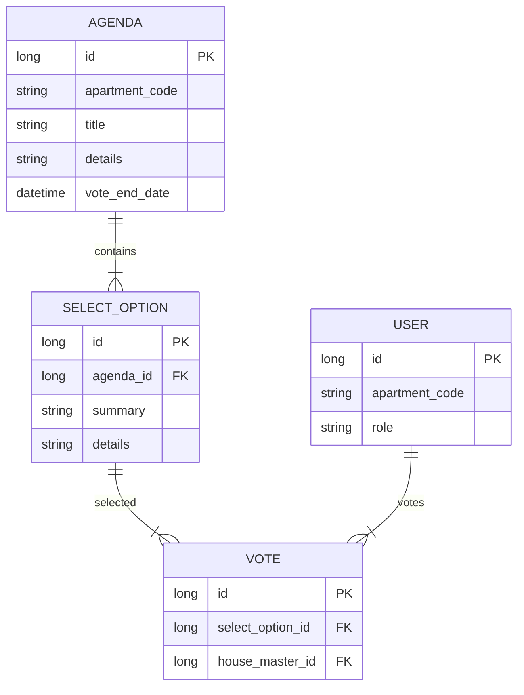
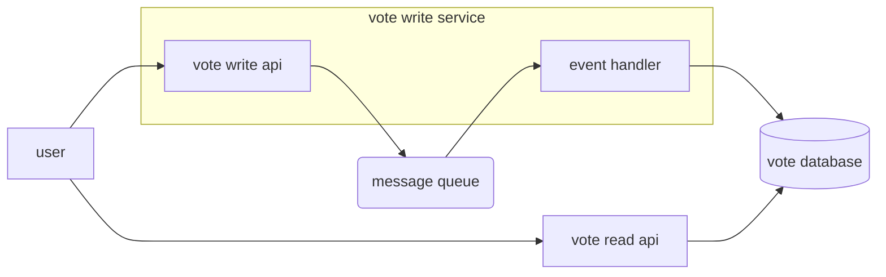

# 주민회의 앱 개발 계획

1. 유저의 타입
    1. 관리자 → 고객관리
    2. 부녀회장
    3. 부녀회원
    4. 세대주
    5. 일반 유저

   |  | 부녀회원 임명 | 안건 상정 | 투표 | 부녀회장 후보 가능성 |
   | --- | --- | --- | --- | --- |
   | 부녀회장  | O | O | O | O |
   | 부녀회원  | X | O | O | O |
   | 세대주   | X | X | O | O |
   | 일반 유저 | X | X | X | X |
2. 주민회의 앱의 기본 컨셉
    1. 각 부녀회장들은 아파트의 투표 안건을 상정할 수 있음
    2. 상정한 안건에 대해 기간을 정하고 투표를 진행함
        1. 비밀회의가 기본이고 세대주만이 투표를 할 수 있다
    3. 기간이 지나면 투표 결과가 나온다
       1. 비밀 투표의 경우 투표 종료 시점까지 투표 결과를 볼 수 없다.
       2. 추후에 비밀 투표가 아닌 안건으로 만들 수 있을 가능성을 생각해서 read api 를 구성한다.
       3. 각 선택지에 투표한 사람 수가 나오고 선택지를 클릭하면 그 선택지에 투표한 사람을 볼 수도 있는 api 도 설계하되 기본적으로는 볼 수 없도록 한다.
    4. 추가 기능 → 각 투표 안건 별 의견방
3. 안건 및 투표
   1. 각 선택지는 기본 설명 + 추가설명을 가진다.
   2. 비밀 여부도 선택 가능
4. 유저의 등록 관리
    1. 각 주민들은 각자 발송된 코드로 인해 결정된다.
    2. 한 세대당 한 사람이 세대주로 등록이 되며 세대원간의 만장 일치로 세대주를 변경할 수 있다.
    3. 이사 등으로 위치를 변경할 수 있으며 우편물 방송을 신청하여 우편물에 지정된 코드를 입력하면 기존 세대주들이 등록해제 된다. (기간은 한달에 한번 신청 가능)

### MICROSERVICE 구성
1. EUREKA SERVER (Residents Meeting - 가장 바깥 프로젝트)
2. API GATEWAY 
3. CONFIG SERVER
4. USER SERVICE
5. VOTE SERVICE (Spring Webflux)
6. KAFKA CONSUMER & BATCH SERVICE

### 투표 관련 ERD

### VOTE SERVICE 예상 구조

